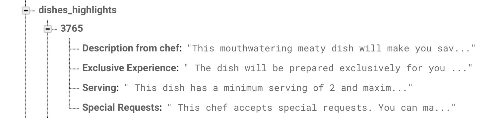
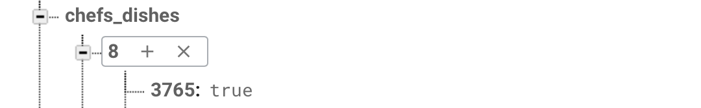
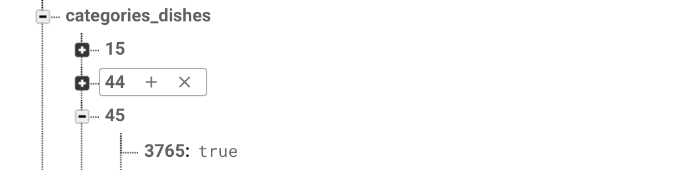
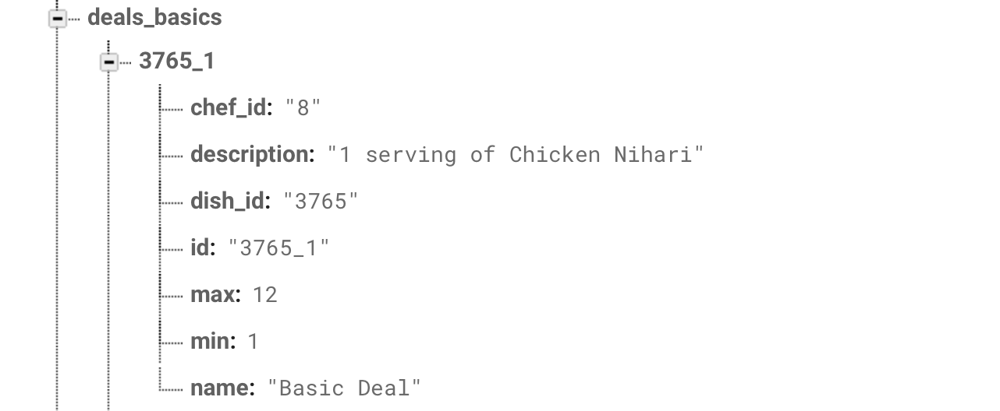
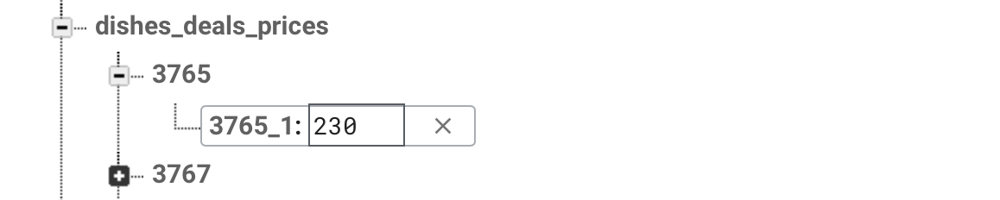

# How to add a dish?

###### Nodes summary :

- `dishes_basics`
- `dishes_highlights`
- `chefs_dishes`
- `categories_dishes`
- `deals_basics`
- `dishes_deals`
- `dishes_deals_prices`


Before adding a dish we'll need an **`id`** for that dish.

> Suppose the **`id`** of our dish is **`"3765"`** 


We'll also need the `id` of the **chef** and the **category** of that dish.

> Assume the chef's **`id`** is **`"8"`**
>
> and assume that the category **`id`** id **`"45"`**


### `dishes_basics` :

In `"dish_basics"` under the `id`( **`"3765"`** ) of the dish store the following details of the dish.

```javascript
{
    "id": "3765",
    "name": "Chicken Nihari",
    "picture": "https://s3-us-east-2.amazonaws.com/foodu/...",
    "preperation_time": 7200000,
    "category": "45",
    "chef": "8"
}
```


**Fields:**

`id` : The id of the dish.

`name`: The name of the dish.

`picture`: Url of the dish's image.

`preperation_time`: The dish's preperation time.

`category`: The **`id`** of the dish's category.

`chef`: The **`id`** of the dish's chef.


What it looks like in firebase.

![Screen Shot 2018-11-07 at 11.55.50 AM][./Screen Shot 2018-11-07 at 11.55.50 AM.png]

### `dishes_highlights` :

In `dishes_highlights` under the `id`( **`"3765"`** ) of the dish store the following details of the dish.

```javascript
{
  "Description from chef" : "This mouthwatering meaty dish..",
  "Exclusive Experience" : " The dish will be prepared exc...",
  "Serving" : " This dish has a minimum serving of 2 and m...",
  "Special Requests" : " This chef accepts special request..."
}
```


What it looks like in firebase.




### `chefs_dishes` :

In `chefs_dishes` under the `id` of the **chef** store the dish's `id`

Given our assumptions of chef and dish `id`s 

The tree will look as follows 

```javascript
"chefs_dishes" : {
    "8" : {
        "3765" : true
    }
}
```


What it looks like in firebase:




### `categories_dishes`:

In `categories_dishes` under the `id` of the **category** store the dish's `id`

Give our assumptions of category and dish `id`s

The tree will look as follows

 ```javascript
"categories_dishes" : {
    "45" : {
        "3765" : true
    }
}
 ```


What it looks like in firebase:




### `deals_basics`:

In `deals_basics` there should be atleast one deal against the dish.

The deal's id should be **`$(dish_id)_1`**. **E.g.** in our case it would be **`"3765_1"`**.

The deal's content are as follows:

```javascript
{
    "id": "3765_1",
    "name": "Basic Deal",
    "description": "1 serving of Chicken Nihari",
    "dish_id": "3765",
    "chef_id": "8",
    "min": 1,
    "max": 12
}
```


**Fields:**

`id`: Id of the deal.

`name`: The deal's name.

`description`: The deal's description. `"$(x) servings of $(dish_name)"`

`dish_id`: The id of the dish which this deal belongs to.

`chef_id`: The id of the chef of that dish.

`min`: Minimum allowed quantity of that deal.

`max`: Maximum allowed quantity of that deal.


What it looks like in firebase.




### `dishes_deals`:

In `dishes_deals` under the `id` of the **dish** store the deal's `id`.

Given our assumptions of the dish's `id`

The tree will look as follows 

````javascript
"dishes_deals" : {
    "3765" : {
        "3765_1" : true
    }
}
````

What it looks like in firebase.


### `dishes_deals_prices`:

In `dishes_deals_prices` under the `id` of the **dish** store the deal's `id` and under that store the **price** of that deal.

Give our assumption of the dishe's `id` the **tree** will look as follows,

```javascript
"dishes_deals_prices" : {
    "3765" : {
        "3765_1" : 230
    }
}
```

What it looks like in firebase:


